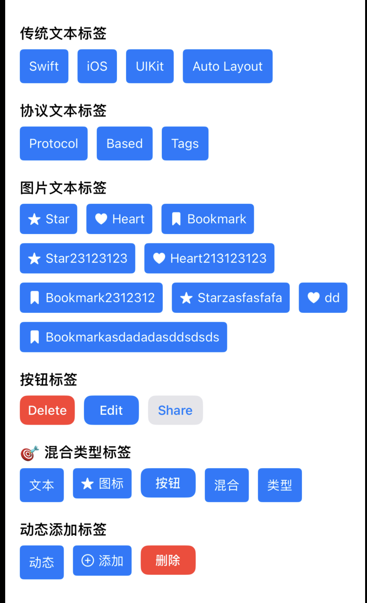
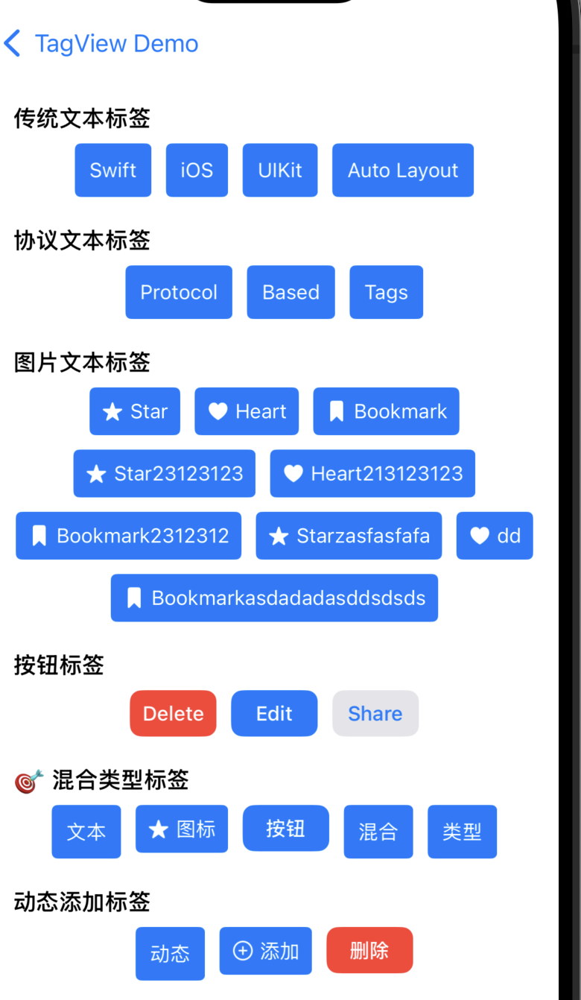
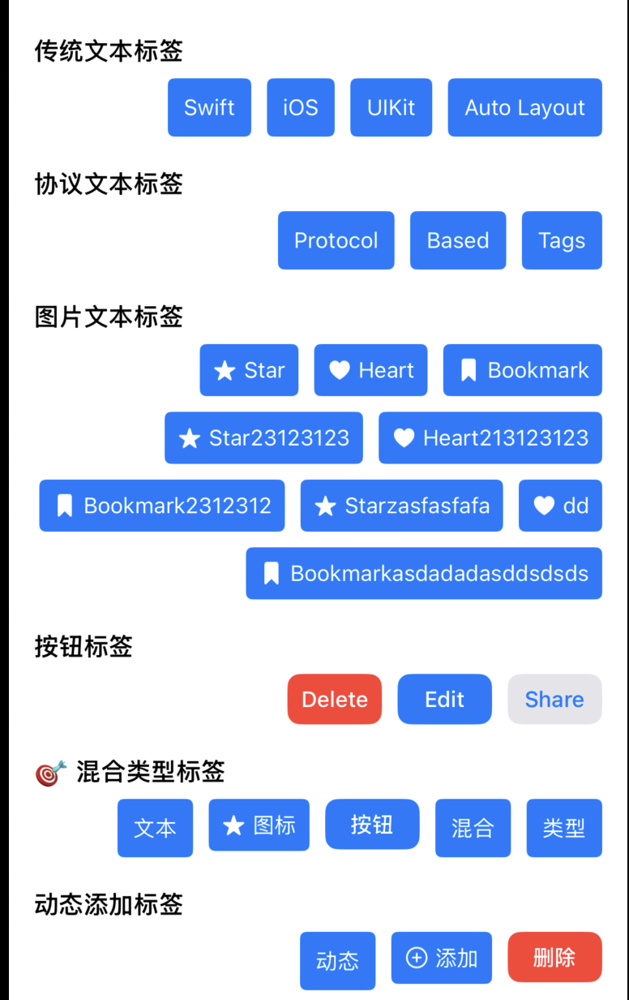

# BRFlexTagView

一个灵活且强大的iOS标签视图组件，支持混合类型标签、自定义样式和自适应布局。

> **🎉 新名称说明**: BRFlexTagView，体现组件的核心特性：**灵活性 (Flexibility)** 和 **可扩展性 (Extensibility)**。同时保持完全向后兼容，现有代码无需修改！

## 特性

- ✅ **混合类型支持**: 在同一个视图中显示不同类型的标签（文本、图片+文本、按钮等）
- ✅ **协议驱动**: 基于协议的架构，易于扩展自定义标签类型
- ✅ **自适应布局**: 支持自适应高度和固定高度两种模式
- ✅ **流式布局**: 自动换行，智能布局标签
- ✅ **行对齐方式**: 支持每行标签的左对齐、居中对齐、右对齐
- ✅ **高度可定制**: 支持自定义间距、圆角、字体、颜色等
- ✅ **便利构造函数**: 支持在初始化时直接配置所有布局参数
- ✅ **增强回调**: onTagTapped 回调提供索引、数据模型、视图实例三个参数
- ✅ **向后兼容**: 完全兼容原有的字符串数组API
- ✅ **内置示例**: 提供文本、图片+文本、按钮标签的示例实现

## 效果展示

### 行对齐方式演示

**左对齐 (Left Alignment)**


**居中对齐 (Center Alignment)**


**右对齐 (Right Alignment)**


### 设置对齐方式

```swift
// 三种设置方式
tagView.lineAlignment = .left      // 左对齐
tagView.lineAlignment = .center    // 居中对齐（推荐默认）
tagView.lineAlignment = .right     // 右对齐

// 便利方法
tagView.setLeftAlignment()         // 左对齐
tagView.setCenterAlignment()       // 居中对齐
tagView.setRightAlignment()        // 右对齐

// 便利构造函数中直接设置
let tagView = BRFlexTagView(
    contentInset: 16,
    tagSpacing: 8,
    lineAlignment: .center,        // 设置对齐方式
    heightMode: .adaptive
)
```

## 安装

### Swift Package Manager

在Xcode中，选择 `File → Add Package Dependencies...`，然后输入：

```
https://github.com/your-username/BRFlexTagView
```

或者在 `Package.swift` 中添加：

```swift
dependencies: [
    .package(url: "https://github.com/your-username/BRFlexTagView", from: "0.0.1")
]
```

## 快速开始

### 基础用法

```swift
import BRFlexTagView

// 推荐使用新名称
let tagView = BRFlexTagView()
tagView.tags = ["Swift", "iOS", "UIKit", "Auto Layout"]
tagView.tagBackgroundColor = .systemBlue
tagView.tagTextColor = .white
tagView.lineAlignment = .center     // 设置居中对齐
tagView.onTagTapped = { index, model, tagView in
    print("Tapped tag at index: \(index)")
    print("Tag model: \(model)")
    print("Tag view: \(tagView)")
}

// 添加到视图
view.addSubview(tagView)
```

### 混合类型标签（推荐）

```swift
import BRFlexTagView

let tagView = BRFlexTagView()

// 批量添加不同类型的标签
tagView.addMixedTags { items in
    // 文本标签
    items.append(AnyFlexTagItem.create(
        data: BRFlexTextTagData(text: "文本标签"), 
        viewType: BRFlexTagItemView.self
    ))
    
    // 图片+文本标签
    items.append(AnyFlexTagItem.create(
        data: BRFlexImageTextTagData(text: "图标", imageName: "star.fill"), 
        viewType: BRFlexImageTextTagView.self
    ))
    
    // 按钮标签
    items.append(AnyFlexTagItem.create(
        data: BRFlexButtonTagData(title: "按钮", style: .primary), 
        viewType: BRFlexButtonTagView.self
    ))
}

tagView.onTagTapped = { index, model, tagView in
    print("Tapped mixed tag at index: \(index)")
    print("Tag model: \(model)")
    
    // 根据不同类型处理
    if let textData = model as? BRFlexTextTagData {
        print("Text tag: \(textData.text)")
    } else if let imageTextData = model as? BRFlexImageTextTagData {
        print("Image+Text tag: \(imageTextData.text)")
    } else if let buttonData = model as? BRFlexButtonTagData {
        print("Button tag: \(buttonData.title)")
    }
}
```

### 便利方法

```swift
// 快速添加不同类型的标签
tagView.addTextTag("简单文本")
tagView.addImageTextTag(text: "星星", imageName: "star.fill")
tagView.addButtonTag(title: "删除", style: .destructive)
tagView.addTextTags(["标签1", "标签2", "标签3"])
```

### 动态操作

```swift
// 添加单个标签
tagView.addTagData(BRFlexTextTagData(text: "新标签"), viewType: BRFlexTagItemView.self)

// 移除标签
tagView.removeTagAt(index: 0)

// 清空所有标签
tagView.clearAllTags()

// 获取当前标签数据
let currentData = tagView.getTagData()
let currentItems = tagView.getTagItems()
```

### 增强的标签点击回调

新版本的 `onTagTapped` 回调提供了更丰富的上下文信息：

```swift
tagView.onTagTapped = { index, model, tagView in
    // 参数说明：
    // index: 被点击标签的索引
    // model: 标签的数据模型（遵循 BRFlexTagItemDataProtocol）
    // tagView: 标签视图本身（BRFlexTagView 实例）
    
    print("点击了第 \(index) 个标签")
    print("标签数据: \(model)")
    print("标签视图: \(tagView)")
    
    // 根据数据类型进行不同处理
    switch model {
    case let textData as BRFlexTextTagData:
        print("文本标签: \(textData.text)")
        
    case let imageTextData as BRFlexImageTextTagData:
        print("图片+文本标签: \(imageTextData.text), 图片: \(imageTextData.imageName)")
        
    case let buttonData as BRFlexButtonTagData:
        print("按钮标签: \(buttonData.title), 样式: \(buttonData.style)")
        
    default:
        print("自定义标签类型: \(type(of: model))")
    }
    
    // 可以访问标签视图的属性和方法
    print("当前标签总数: \(tagView.getTagItems().count)")
    print("当前对齐方式: \(tagView.lineAlignment)")
    
    // 动态操作示例
    if index == 0 {
        // 点击第一个标签时，切换对齐方式
        tagView.lineAlignment = tagView.lineAlignment == .left ? .center : .left
    }
}
```

### 实际使用场景

```swift
// 场景1: 删除被点击的标签
tagView.onTagTapped = { index, model, tagView in
    let alert = UIAlertController(title: "删除标签", message: "确定要删除这个标签吗？", preferredStyle: .alert)
    alert.addAction(UIAlertAction(title: "删除", style: .destructive) { _ in
        tagView.removeTagAt(index: index)
    })
    alert.addAction(UIAlertAction(title: "取消", style: .cancel))
    self.present(alert, animated: true)
}

// 场景2: 根据标签类型执行不同操作
tagView.onTagTapped = { index, model, tagView in
    if let textData = model as? BRFlexTextTagData {
        // 编辑文本标签
        self.showTextEditDialog(for: textData, at: index, in: tagView)
    } else if let buttonData = model as? BRFlexButtonTagData {
        // 执行按钮操作
        self.executeButtonAction(buttonData.title)
    }
}

// 场景3: 标签选择状态管理
var selectedIndices: Set<Int> = []
tagView.onTagTapped = { index, model, tagView in
    if selectedIndices.contains(index) {
        selectedIndices.remove(index)
        // 取消选择样式
    } else {
        selectedIndices.insert(index)
        // 应用选择样式
    }
    
    print("已选择标签: \(selectedIndices)")
}
```

## 自定义标签类型

### 1. 创建数据模型

```swift
struct CustomTagData: BRFlexTagItemDataProtocol {
    let identifier: String
    let title: String
    let subtitle: String
    let viewData: Any
    
    init(title: String, subtitle: String) {
        self.title = title
        self.subtitle = subtitle
        self.identifier = "\(title)_\(subtitle)"
        self.viewData = (title: title, subtitle: subtitle)
    }
}
```

### 2. 创建视图类

```swift
class CustomTagView: UIView, BRFlexTagItemViewProtocol {
    typealias DataType = CustomTagData
    
    weak var delegate: BRFlexTagItemViewDelegate?
    var index: Int = 0
    
    private let titleLabel = UILabel()
    private let subtitleLabel = UILabel()
    
    required init(data: CustomTagData) {
        super.init(frame: .zero)
        setupView()
        updateData(data)
    }
    
    required init?(coder: NSCoder) {
        super.init(coder: coder)
        setupView()
    }
    
    func updateData(_ data: CustomTagData) {
        titleLabel.text = data.title
        subtitleLabel.text = data.subtitle
    }
    
    private func setupView() {
        // 设置视图布局...
    }
    
    override func sizeThatFits(_ size: CGSize) -> CGSize {
        // 计算视图尺寸...
    }
}
```

### 3. 使用自定义标签

```swift
let customData = CustomTagData(title: "主标题", subtitle: "副标题")
tagView.addTagData(customData, viewType: CustomTagView.self)
```

## 配置选项

### 间距配置

```swift
// 内容区域内边距
tagView.contentInsets = UIEdgeInsets(top: 16, left: 16, bottom: 16, right: 16)

// 标签间距
tagView.tagHorizontalSpacing = 8.0    // 标签水平间距
tagView.tagVerticalSpacing = 12.0     // 标签垂直间距（行间距）

// 便利方法
tagView.setContentInsets(16)                    // 统一内边距
tagView.setContentInsets(horizontal: 16, vertical: 8)  // 水平和垂直内边距
tagView.setTagSpacing(horizontal: 8, vertical: 12)     // 标签间距
tagView.setTagSpacing(10)                       // 统一标签间距

// 批量配置间距
tagView.configureSpacing(
    contentInsets: UIEdgeInsets(top: 16, left: 16, bottom: 16, right: 16),
    tagHorizontalSpacing: 8,
    tagVerticalSpacing: 12
)
```

### 行对齐方式

```swift
// 三种对齐方式
tagView.lineAlignment = .left       // 左对齐
tagView.lineAlignment = .center     // 居中对齐
tagView.lineAlignment = .right      // 右对齐

// 便利方法
tagView.setLeftAlignment()
tagView.setCenterAlignment()
tagView.setRightAlignment()

// 批量配置布局
tagView.configureLayout(
    alignment: .center,
    contentInsets: UIEdgeInsets(top: 16, left: 16, bottom: 16, right: 16),
    tagHorizontalSpacing: 8,
    tagVerticalSpacing: 12
)
```

### 样式配置

```swift
tagView.tagCornerRadius = 4.0               // 圆角半径
tagView.tagFont = .systemFont(ofSize: 14)   // 字体
tagView.tagBackgroundColor = .systemBlue    // 背景色
tagView.tagTextColor = .white               // 文字颜色
```

### 高度模式

```swift
tagView.heightMode = .adaptive      // 自适应高度（推荐）
tagView.heightMode = .fixed(100)    // 固定高度100
```

### 便利构造函数

```swift
// 完整配置构造
let tagView = BRFlexTagView(
    contentInsets: UIEdgeInsets(top: 16, left: 16, bottom: 16, right: 16),
    tagHorizontalSpacing: 8,
    tagVerticalSpacing: 12,
    lineAlignment: .center,
    heightMode: .adaptive
)

// 统一间距构造
let tagView = BRFlexTagView(
    contentInset: 16,
    tagSpacing: 8,
    lineAlignment: .center
)

// 水平垂直间距构造
let tagView = BRFlexTagView(
    horizontalInset: 16,
    verticalInset: 8,
    horizontalSpacing: 8,
    verticalSpacing: 12,
    lineAlignment: .center
)
```

## 内置标签类型

### BRFlexTextTagData + BRFlexTagItemView
基础文本标签，支持单行和多行文本。

### BRFlexImageTextTagData + BRFlexImageTextTagView
图片+文本标签，左侧显示图标，右侧显示文本。

### BRFlexButtonTagData + BRFlexButtonTagView
按钮样式标签，支持不同样式（primary、secondary、destructive）。

> **向后兼容性**: 旧名称（如 `BRTextTagData`、`BRTagItemView` 等）仍然可用，它们是新名称的类型别名。

## 示例

查看 `BRTagViewExampleViewController` 了解完整的使用示例。

## 系统要求

- iOS 13.0+
- Swift 5.9+
- Xcode 15.0+

## 许可证

MIT License

## 贡献

欢迎提交 Issue 和 Pull Request！ 
